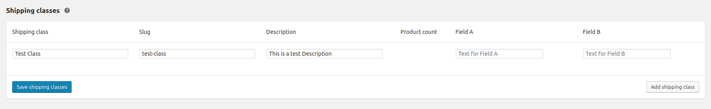
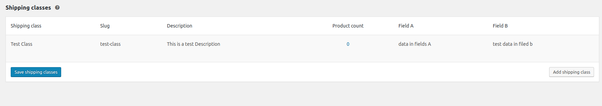

<h1> HACK #1 - Adding a custom field to shipping class </h1>

<p><b>Check the plugin code for usage</b></p>
<p><b>Main code inside -></b> class-custom-woo-shipping-class-fields.php</p>

*STEP 1 - Display Field Name in Header*
```php
//loc: woocommerce/includes/admin/settings/class-wc-settings-shipping.php #adding coulmns to list header
apply_filter('woocommerce_shipping_classes_columns', $shipping_columns_array) ;
```

*STEP 2 - Display Fields*
```php
//loc: woocommerce/includes/admin/settings/views/html-admin-page-shipping-classes.php
do_action('woocommerce_shipping_classes_column_'.$class)
```



*STEP 3 - Update the database with the values set*

```php
//loc: woocommerce/includes/class-wc-ajax.php #function to add/update shipping class metas value
do_action('woocommerce_shipping_classes_save_class', $term_id, $data);
```


*STEP 4 - Modify shipping class object to add these fields' data before localization*
```php
//loc: woocommerce/includes/class-wc-shipping.php #function to modified localized shipping class data
apply_filter('woocommerce_get_shipping_classes', $shipping_classes);
```


